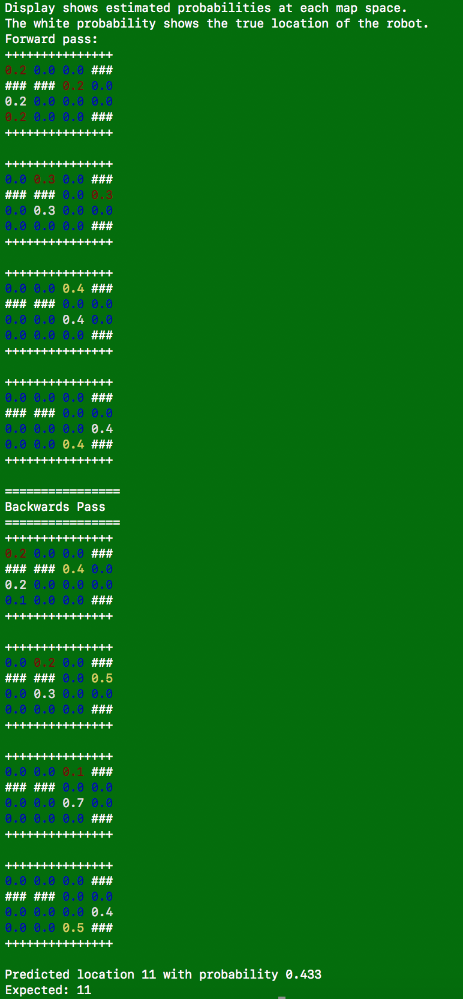

#HMM Assignment
Chris Miller '20

## HMM Outline
The HMM class stores various details of the implementation (such as number of states, the colors, etc.) as well as the current and past prior calculations.

Filtering is done in the `filter` function. It traverses through each provided reading by first projecting the current distribution forward (via the `move_state` function) and then update based on evidence probabilities via `get_evidence_prob` and normalize (calculate alpha) via `normalize`. 

The `move_state` function updates the current state based on transition probabilities. For every state, it multiplies the current estimated probability of that state by the state's precalculated transition probabilities (so the probability  that a state is in location 5 is split equally between locations 1, 4, 6, and 9. This calculated distribution from each state is then summed (so that location 1, for example, is the sum of weighted transitions from 0, 5, 2, and 1 itself). This projects the current state forward based on equal probabilities of moving in each direction.

The `get_evidence_prob` function simply calculates, for each potential state, the probability of seeing the received reading P(reading=reading | state). As discussed in the assignment, this is .88 if reading = state and .04 otherwise. 

`normalize` implements the multiplication by alpha part of the algorithm by taking np.sum of the current calculated prior and dividing the prior by the sum (since we know that the sum must be 1 in the true distribution). 

My display function uses a heatmap output, where low probabilities are shown in blue, medium probabilities in red, and high probabilities in yellow. This also allows me to show the true location in white.

### Testing

My first maze test used Maze.maz, shown below

	rbgy
	ygrb
	rbgy
	ryyg
	
Maze.maz with colors translated into numerical values:

	0 2 1 3
	3 1 0 2
	0 2 1 3
	0 3 3 1

And coded with location indices for ease of reading test results:

	00 01 02 03
	04 05 06 07
	08 09 10 11
	12 13 14 15
	
This example shows the results for the sensor sequence 0213 ('r', 'b', 'g', 'y').

As shown, maze.maz has two obvious 0213 sequences in the first and third rows, and I expected probabilities to be divided between them. But what I didn't realize was that there were two 0213 sequences (covering spaces [0, 1, 5, 4] and [8, 9, 5, 4]) which both ended at space 4, meaning that space 4 was in fact the most likely endpoint, which the filtering algorithm correctly predicted.

	

My second test shows the results of providing the algorithm more information. Sequences which appear at many locations in the maze (such as 0-2-1-3) make calculating the correct location difficult. As shown above, probabilities end up split between every possible path. 

	

Here seven unique observations results in good convergence. However, it is important to note that, as seen in the fifth estimation, even a highly likely state (here calculated to be about 80% likely) can diverge extremely rapidly (splitting into three states, each with about 30% likelihood, just one iteration later). 

I finally experimented with walls, and show that reducing the number of possible paths allows for more confident and accurate predictions for short readings sequences (such as 0-2-1-3, shown here).

This test uses walls.maz:

	rbg#
	##rb
	rbgy
	ryy#
	
which is a copy of maze.maz but with inserted walls.

## Forward-Backward Smoothing

I also implemented forward-backward smoothing as described in the textbook. This uses the `smooth` function, which calculates backwards probabilities from the last state back to the first using `get_back_prob`, calculating the probability of each state given all readings afterwards. 

This proves to increase accuracy of predictions, since the algorithm can essentially eliminate paths which match the data well in the beginning but fail to match later on. This is best shown in the walls example above. The forward pass thinks that the sequence on the top row is just as likely as the true sequence on the third row up until the top row sequence hits a wall and cannot explain the final reading. The backwards path, meanwhile, is able to explain the data much better by incorporating the later readings data and correctly indicating that the top row sequence is unlikely.